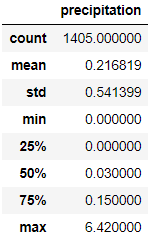

# Surfs Up Analysis

## Overview
The purpose of conducting this analysis is to determine sustainability for an openning of an ice-cream and surf shop on the island of Oahu based on weather trends, as weather plays a big factor on both icecream sales and surfing possibilities.

### Results
Viewing data collected by weather stations on Oahu starting from 2018 and looking back, there is a fair bit of data for this reigon. Our two primary points of analysis were two months of the year, june and december. June being peak summer and december being mid-winter, looking at these two points provided us ample temperature data, and from it we come to a few conclusions, based on our tables displayed below:

(For reference, The right table is for the month of june while the left table is for the month of december)

* The average temperature during the month of june in Oahu is 74.9 degrees fahrenheit (23.8 degrees celsius)
* The average temperature during the month of december in Oahu is 71.0 degrees fahrenheit (21.7 degrees celsius)
* Although the temperature in june is higher on average, Oahu maintains a constant overall warm climate, bordering on tropical based on its average

#### Summary
Looking at our collected data we can see that, from a temperature standpoint, Oahu maintains an overall 73 degrees fahrenheit (22.7 degrees celsius), making our chosen location a warm spot to set up year round. However, temperature is not the only factor for weather. Considering this, we also looked into average precipitation during our selected months, to get a gist of what we were getting into, and came up with these results, displayed by the tables below:

(For reference, The right table is for the month of june while the left table is for the month of december)

The numbers being displayed are percentages of precipitation, with june having a 13.6% chance for precipitation on average, while december boasts a 21.7% chance for precipitation on average. Crunching the numbers, our tables show that there can be anywhere between 4 to 6.5 days worth of rain on average per month, leaving quite a large chunck of a month for clear skys and cool waves. Based on these two different attributes, we can say that a Surf and Icecream shop can be sustainable within Oahu, as the consistantly sunny weather guarentees surfers and people looking to keep cool in the hot weather.

Should more analysis be needed, some attributes to look into would be foginess, cloudiness and humidity. They do affect the reigon and thus, if there is an imbalance of any of these in unfavorable directions, might dissuade potential customers and may be a factor to consider in sustainablility.
